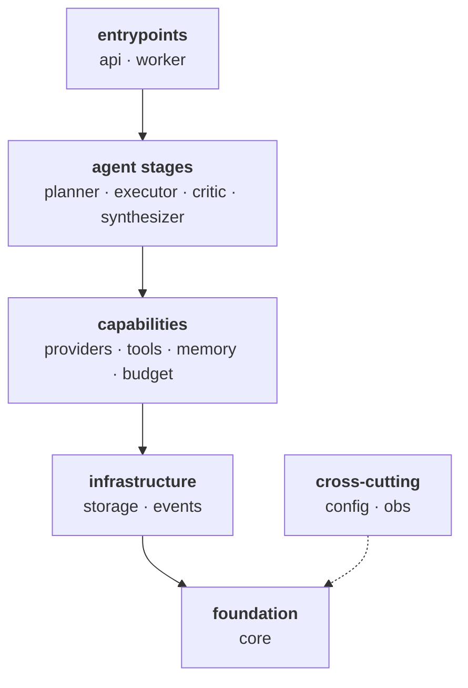

# researchmind

**A research agent that answers open-ended questions with a report you can check.**

Not a chat wrapper. The output is not prose — it is a structured artefact in which every
factual statement carries a source URL, a supporting quote and a confidence level, or is
explicitly marked as unverified. Nothing in between. No claim reaches a reader unattributed.

```
"Compare regulatory approaches to stablecoins across US, EU and Singapore in 2025."
"Top 5 vector databases for enterprise RAG under 50ms — and what they cost at 100M vectors."
"How has Rust adoption in fintech backends evolved from 2022 to 2025?"
```

---

## How it works

| Stage | What happens | Why it is separate |
| --- | --- | --- |
| **Plan** | The question is decomposed into typed sub-questions | You inspect, edit or reject the plan before a single tool call is paid for |
| **Search** | Web, ArXiv, GitHub, Hacker News, PDFs — through typed tool contracts | The model sees schemas, the runtime enforces them |
| **Read** | Documents are fetched, parsed and chunked in full | Search snippets are evidence of a source, not the source |
| **Reason** | Findings are synthesised across sources | Contradictions are surfaced, not averaged away |
| **Critique** | An adversarial pass re-checks every claim against the raw excerpts | The critic never sees the executor's reasoning, so it cannot inherit its mistakes |
| **Cite** | The report is assembled with mandatory attribution | An uncited claim is a bug, not a stylistic choice |

Running underneath all six: hard token, dollar and wall-clock budgets at three scopes,
per-call cost accounting, and an append-only event log from which any run is
reconstructible in full.

---

## Design principles

These are load-bearing. Every design decision in this repository must satisfy all of them.

1. **Plan first, execute after.** No tool call before an approved, typed plan exists.
2. **Tools are typed contracts.** Schema in, schema out, plus a cost model, a timeout and a
   failure taxonomy. Malformed model output triggers typed retry with the error fed back —
   never a crash, never a silent skip.
3. **Memory has layers.** Short-term, working, episodic, semantic — each with explicit read
   and write rules.
4. **Critique is first-class.** A separate pass, a different prompt, an evidence-only context.
5. **Every claim is cited or explicitly unverified.** "No source found" is a valid output.
   An invented source is not.
6. **Budgets are hard.** Reserve before the call, commit after. A call that might not fit is
   never started.
7. **Cost and traces are transparent.** Tokens, latency, dollars, provider, model,
   temperature and prompt version, correlated by `run_id → step_id → call_id`.
8. **Deterministic where possible.** LLM and tool responses are recorded and replayable.
   This is what makes evaluation a measurement rather than an impression.

---

## Architecture

A **modular monolith** in a single repository. Two runtime services, because they have
genuinely different lifecycles; everything else is a Python module with a typed interface.
Microservices would buy independent scaling we do not need and charge network boundaries
where type boundaries already work.



Dependencies point downward only. These rules are executable — `make arch` runs them as
`import-linter` contracts, so a violation fails the build rather than surviving review:

- **Dependencies point downward only** — no upward or sideways imports between layers
- **Vendor SDKs are confined to `providers`** — nothing else may import `anthropic`,
  `openai` or `instructor`
- **Database access is confined to `storage`** — nothing else may import `asyncpg`
- **`core` imports nothing of ours** — not even `config` or `obs`
- **Cross-cutting stays cross-cutting** — `config` and `obs` may not reach into the agent

| Package | Role |
| --- | --- |
| `core` | Domain types: `ResearchQuestion`, `Plan`, `Fact`, `Source`, `Claim`, `Report`, `Budget`, `Cost` |
| `providers` | LLM and embedding interfaces, vendor adapters, structured output, cost accounting |
| `budget` | Reserve-then-commit budgets at call / sub-question / run scope |
| `tools` | `web_search`, `web_fetch`, `arxiv_search`, `github_search`, `pdf_reader`, `hn_search` |
| `memory` | Short-term, working, episodic and semantic layers |
| `planner` | Plan generation, validation, revision |
| `executor` | Sub-question loop and fact extraction with source binding |
| `critic` | Claim-versus-source verification |
| `synthesizer` | Report assembly with mandatory citations |
| `storage` | Pool, hand-written SQL, migrations, tenant isolation |
| `events` | Append-only run events, PostgreSQL persistence, Redis Streams fan-out |
| `obs` | Structured logging and OpenTelemetry |
| `config` | The only reader of the environment |
| `api` | Control plane: lifecycle, plan approval, SSE stream, cancellation |
| `worker` | Long-lived run consumer |
| `sdk` | Thin async client |
| `eval` | Deterministic harness: seed questions, cassettes, quality metrics |

---

## Stack

Python 3.12 · `mypy --strict` · `ruff` · Pydantic v2 · FastAPI · asyncpg + PostgreSQL 16 ·
Qdrant · Redis Streams · httpx · `instructor` · OpenTelemetry · pytest + hypothesis +
testcontainers · React 19 + Vite · Docker Compose · GitHub Actions

Anthropic, OpenAI and vLLM sit behind one provider interface. No agent framework is used —
we are building the agent, not gluing one together.

---

## Status

The repository is being built in reviewed phases. This table describes what **exists**,
not what is intended.

| Phase | Scope | State |
| --- | --- | --- |
| 1 | Repository skeleton, tooling, CI, dev compose | in progress |
| 2 | Domain types with property-based tests | — |
| 3 | Provider interface, cost accounting, structured output | — |
| 4 | Budget enforcer, three scopes | — |
| 5 | Tool interface, `web_search`, `web_fetch` | — |
| 6 | Memory layers | — |
| 7 | Planner | — |
| 8 | Executor loop | — |
| 9 | Fact extraction with source binding | — |
| 10 | Critic pass | — |
| 11 | Synthesizer | — |
| 12 | Remaining tools | — |
| 13 | Semantic memory on Qdrant | — |
| 14 | API control plane, SSE, cancellation | — |
| 15 | React UI | — |
| 16 | Evaluation harness, 20 seed questions | — |
| 17 | Observability, benchmarks, ADRs | — |

**No agent behaviour exists yet.** Package boundaries and a locked environment exist;
what runs inside them does not. This section will say how to run things once there is
something to run.

### Increments delivered

| # | What landed |
| --- | --- |
| 1.1 | Package tree with boundary docstrings, root configuration files, this README |
| 1.2 | `pyproject.toml` with exact pins, `uv.lock` (98 packages), `Makefile`, `.gitattributes` |
| 1.3 | `ruff` / `mypy --strict` / `import-linter` / `pytest` configuration, first tests |
| 1.4 | `docker-compose.yml` for PostgreSQL, Qdrant and Redis; `.env.example`; compose targets |

---

## Working on it

Requires **Python 3.12**, **[uv](https://docs.astral.sh/uv/)** and **Docker**.

```bash
make install   # uv sync --all-groups
make lint      # ruff check + ruff format --check
make types     # mypy --strict over researchmind and tests
make arch      # import-linter: the layering above, enforced
make test      # unit tests
make check     # lint + types + arch + test
```

`make check` is green.

### Local data services

```bash
cp .env.example .env   # optional: the compose defaults already match it
make up                # starts the three services and waits for them to be healthy
make ps
make logs
make down              # stops them, keeps the data
make reset CONFIRM=yes # stops them and deletes the volumes
```

| Service | Image | Address | Holds |
| --- | --- | --- | --- |
| PostgreSQL | `postgres:16.14-bookworm` | `127.0.0.1:5432` | Run state, event log, memory, cost accounting |
| Qdrant | `qdrant/qdrant:v1.18.3` | `127.0.0.1:6333` / `:6334` | Embedded facts for cross-sub-question recall |
| Redis | `redis:8.6.5-alpine` | `127.0.0.1:6379` | The hot tail of the event stream — nothing durable |

Three choices in that file are load-bearing rather than incidental:

- **PostgreSQL uses `C.UTF-8` collation.** Byte order is deterministic, survives a glibc
  upgrade underneath a live index, and lets `LIKE 'prefix%'` use a b-tree. Linguistic
  ordering is requested explicitly with `COLLATE` where it is actually wanted.
- **Redis has no volume and no persistence.** It carries the hot tail of the event
  stream; PostgreSQL is the source of truth and a reconnecting client re-reads what it
  missed from there. The configuration states that rather than hiding it.
- **All ports are published on `127.0.0.1`** and are overridable, because a developer
  machine often already has something on 5432.

Dependency versions are pinned exactly in `pyproject.toml` and resolved in `uv.lock`.
Both are committed: an upgrade is an explicit edit reviewed as a lock diff, never a
silent drift. Leaf libraries that constrain nothing else in the graph are added in the
phase that first imports them.

---

## Conventions

- **Prompts are code.** They live in versioned files under `prompts/`, one file per version,
  never as inline string literals. A prompt version is recorded with every call it produced.
- **Types at every boundary.** No `Any` in signatures, no untyped `dict`. Every
  `# type: ignore` carries an inline reason.
- **Hand-written SQL,** parameterised, no ORM on hot paths.
- **Typed errors,** rooted per module. Never a bare `Exception`.
- **Structured logging** correlated by `run_id`. Never `print`.
- **Small commits,** present tense, imperative, one logical change each.
- **This README tracks reality** and is updated with every commit.
